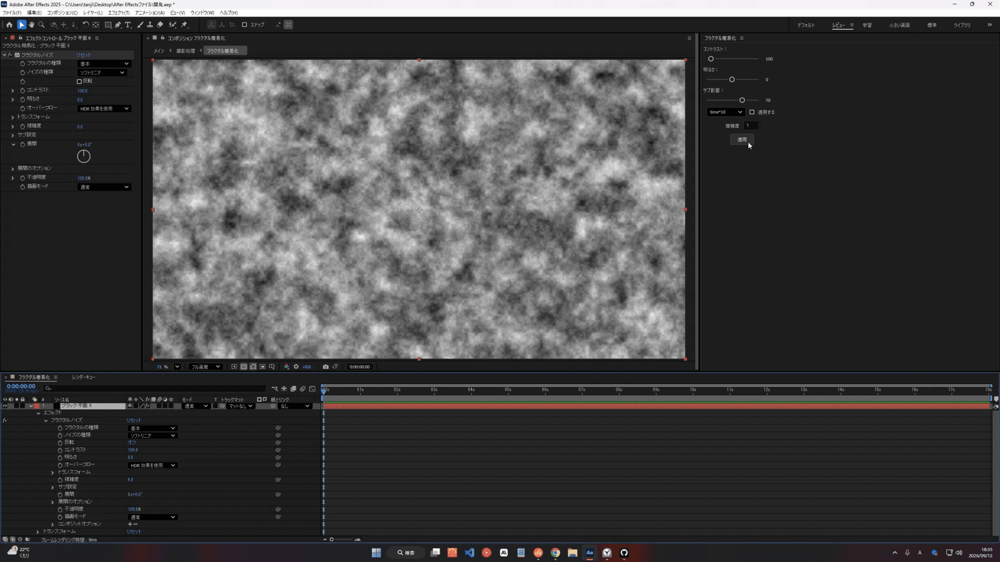
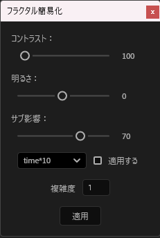

# フラクタル簡易化

After Effects のフラクタルノイズで使用頻度の高いパラメータを、一つのパネルにまとめた ScriptUI パネルです。
エフェクトコントロールを開いて項目を探す手間を省き、スライダーで直接調整できます。



## できること

- コントラスト・明るさ・サブ影響をスライダーで調整
- 複雑度を 1〜20 の範囲で指定
- 「展開」に時間経過のエクスプレッションをワンクリックで適用

## 動作環境

| 項目 | 内容 |
| --- | --- |
| After Effects | CC 2025 / 2026 |
| OS | Windows 11（macOS は未検証） |

## インストール

1. `フラクタル簡易化.jsx` をダウンロードします。
2. 下記のフォルダに配置します。
   - Windows: `C:\Program Files\Adobe\Adobe After Effects <version>\Support Files\Scripts\ScriptUI Panels`
3. After Effects を再起動します。
4. `ウィンドウ` メニューの一覧に `フラクタル簡易化.jsx` が追加されます。

## 使い方



1. 対象のレイヤーを選択します。
   - フラクタルノイズが未適用のレイヤー → 新規に適用されます
   - すでに適用済みのレイヤー → 既存のエフェクトの値が変更されます
2. コントラスト・明るさ・サブ影響をスライダーで設定します。
3. 複雑度を入力します（1〜20）。
4. 展開をアニメーションさせる場合は、倍率を選んで「適用する」にチェックを入れます。
5. 「適用」ボタンを押します。

---

## 実装のポイント

### 使用頻度の高いパラメータの集約

【なぜこの4項目とエクスプレッションを選んだのか。
　ガチャ版と同じく、実際のプロジェクトファイルを確認した話が使えるはず】

### スライダーの値を即時表示

ScriptUI のスライダーは現在値を表示しないため、隣に `statictext` を置き、
`onChanging` で更新しています。
`onChange` ではドラッグを離すまで数値が変わらず、
調整中に今どの値なのか分からなくなるため、変化中に追従する方を選びました。

```javascript
slider.onChanging = function () {
    valueText.text = Math.round(slider.value);
};
```

### 複雑度のみ入力欄にした理由

【スライダーではなく edittext にした理由。
　1〜20 の整数でスライダーでは狙った値に合わせにくい、などが考えられる】

### 1項目分をまとめて関数化

ラベル・スライダー・数値表示を1セットとして `createSlider` に関数化し、
項目ごとに呼び出す構成にしました。
サイズ指定や数値表示の更新処理が1箇所にまとまるため、
項目を追加してもレイアウトの一貫性が崩れません。

### エクスプレッションの適用を任意にした

展開へのエクスプレッション適用はチェックボックスで切り替えられるようにしています。
静止したノイズが欲しい場合と、時間で変化させたい場合の両方があるため、
常に適用する仕様にはしませんでした。

---

## 今後の課題

- Undo グループが `try...finally` で保護されておらず、処理の途中で例外が出るとスタックが開いたままになる
- 値の適用を `try...catch` で囲んでいるが、失敗しても通知されないため、原因が分からないまま何も起きない状態になる
- 複雑度のみキーフレーム削除の対象外になっており、キーフレームがある場合に値が反映されない
- 【他にあれば追加】

## 配布先

BOOTH で配布しています: 【URL】

## ライセンス

MIT License
